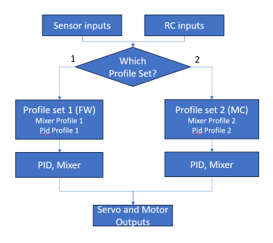
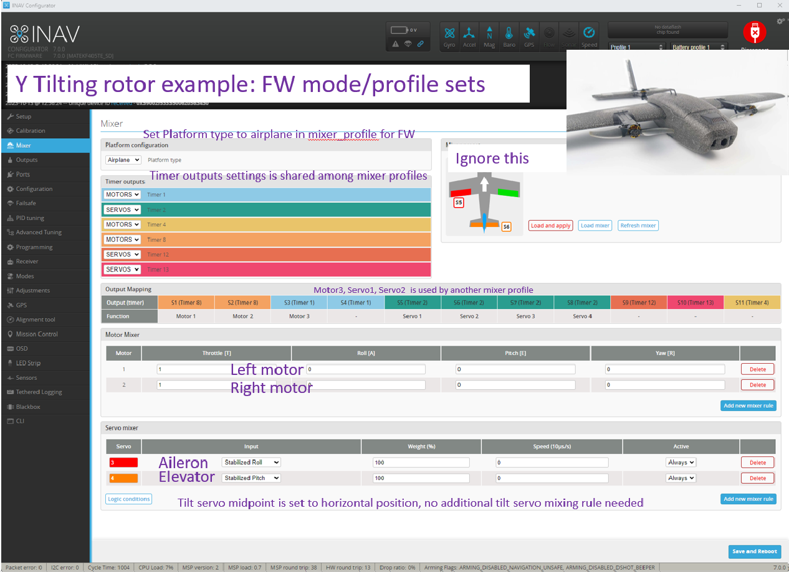
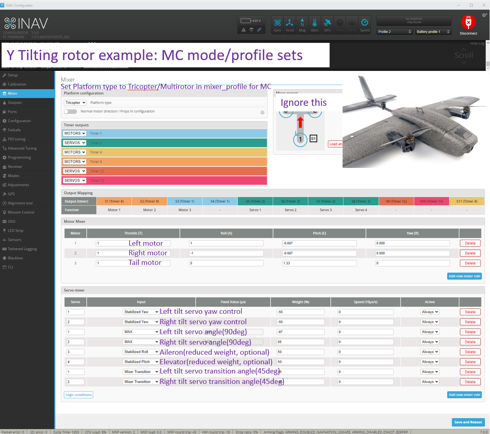

# Welcome to INAV VTOL Testing

Thank you for participating in the INAV VTOL testing phase.

## Who Should Use This Tutorial?

This tutorial is designed for individuals who have prior experience with **both INAV multi-rotor and INAV fixed-wing configurations/operations.** If you're not familiar with them, this tutorial might be not for you.

## Firmware Status

The firmware is in a flyable state, but it hasn't undergone extensive testing yet. This means there may be potential issues that have not yet been discovered.

## Future Changes

Please be aware that both the setup procedure and firmware may change in response to user feedback and testing results. 
## Your Feedback Matters

We highly value your feedback as it plays a crucial role in the development and refinement of INAV VTOL capabilities. Please share your experiences, suggestions, and any issues you encounter during testing. Your insights are invaluable in making INAV VTOL better for everyone.

# VTOL Configuration Steps

### The VTOL functionality is achieved by switching/transitioning between two configurations stored in the FC. VTOL specific configurations are Mixer Profiles with associated PID profiles. One profile set is for fixed-wing(FW) mode, One is for multi-copter(MC) mode. Configuration/Settings other than Mixer/PID profiles are shared among two modes 


0. **Find a DIFF ALL file for your model and start from there if possible**
   - Be aware that `MIXER PROFILE 2` RC mode setting introduced by diff file can get your stuck in a mixer_profile. remove or change channel to proceed
1. **Setup Profile 1:**
   - Configure it as a normal fixed-wing/multi-copter.

2. **Setup Profile 2:**
   - Configure it as a normal multi-copter/fixed-wing.

3. **Mode Tab Settings:**
   - Set up switching in the mode tab.

4. *(Recommended)* **Transition Mixing (Multi-Rotor Profile):**
   - Configure transition mixing to gain airspeed in the multi-rotor profile.

5. *(Recommended)* **VTOL-Specific Settings:**
   - Configure VTOL-specific settings.

6. *(Optional)* **Automated Switching (RTH):**
   - Optionally, set up automated switching in case of failsafe.

# STEP1&2: Configuring as a Normal fixed-wing/Multi-Copter in two profiles separately

1. **Select the fisrt Mixer Profile and PID Profile:**
   - In the CLI, switch to the mixer_profile and pid_profile you wish to set first:
     ```
     mixer_profile 1 #in this example, we set profile 1 first
     set mixer_pid_profile_linking = ON  # Let the mixer_profile handle the pid_profile switch on this mixer_profile
     set platform_type = AIRPLANE
     save
     ```

2. **Configure the fixed-wing/Multi-Copter:**
   - Configure your fixed-wing/Multi-Copter as you normally would, or you can copy and paste default settings to expedite the process.
   - Dshot esc protocol availability might be limited depends on outputs and fc board you are using. change the motor wiring or use oneshot/multishot esc protocol and calibrate throttle range.
   - You can use throttle = -1 as a placeholder for the motor you wish to stop if the motor isn't the last motor
   - Consider conducting a test flight to ensure that everything operates as expected. And tune the settings, trim the servos.



3. **Switch to Another Mixer Profile with PID Profile:**
   - In the CLI, switch to another mixer_profile along with the appropriate pid_profile:
     ```
     mixer_profile 2
     set mixer_pid_profile_linking = ON
     set platform_type = MULTIROTOR
     save
     ```

4. **Configure the Multi-Copter/fixed-wing:**
   - Set up your multi-copter/fixed-wing as usual, this time for mixer_profile 2 and pid_profile 2.
   - Utilize the 'MAX' input in the servo mixer to tilt the motors without altering the servo midpoint.
   - At this stage, focus on configuring profile-specific settings. You can streamline this process by copying and pasting the default PID settings.
   - compass is required to enable navigation modes for multi-rotor profile.
   - Consider conducting a test flight to ensure that everything operates as expected. And tune the settings.
   - It is advisable to have a certain degree of control surface (elevon / elevator) mapping for stabilization even in multi-copter mode. This helps improve control authority when airspeed is high.



5. **Tailsitters:**
Working in progress. 
   - Configure the fixed-wing mode/profile sets normally. Use MultiCopter platform type for tail_sitting flying mode/profile sets. 
   - The baseline board aliment is FW mode(ROLL axis is the trust axis). So set `tailsitter_board_orientation = ON ` in the tail_sitting MC mode.
   - Configure mixer ROLL/YAW mixing according to tail_sitting orientation in the tail_sitting MC mode. YAW axis is the trust axis.
   - Conduct a bench test and see the orientation of the model changes in inav-configurator setup tab

# STEP3: Mode Tab Settings:
### We recommend using an 3-pos switch on you radio to activate these modes, So pilot can jump in or bell out at any moment.
### Here is a example, in the bottom of inav-configurator Modes tab:

|  1000~1300 |  1300~1700  | 1700~2000 |
| :-- | :-- | :-- |
| Profile1(FW) with transition off |  Profile2(MC) with transition on  | Profile2(MC) with transition off |

- Profile file switching becomes available after completing the runtime sensor calibration(15-30s after booting). And It is **not available** when a navigation mode or position hold is active.

- By default, `mixer_profile 1` is used. `mixer_profile 2` is used when the `MIXER PROFILE 2` mode is activate. Once configured successfully, you will notice that the profiles and model preview changes accordingly when you refresh the relevant INAV Configurator tabs. 

- Use the `MIXER TRANSITION` mode to gain airspeed in MC profile, set `MIXER TRANSITION` accordingly.

Conduct a bench test on the model (without props attached). The model can now switch between fixed-wing and multi-copter modes while armed. Furthermore, it is capable of mid-air switching, resulting in an immediate stall upon entering fixed-wing profile

# STEP4: Transition Mixing (Multi-Rotor Profile)(Recommended)
### Transition Mixing is typically useful in multi-copter profile to gain airspeed in prior to entering the fixed-wing profile. When the `MIXER TRANSITION` mode is activated, the associated motor or servo will move according to your configured Transition Mixing. 

Please note that transition input is disabled when a navigation mode is activated. The use of Transition Mixing is necessary to enable additional features such as VTOL RTH with out stalling.
## Servo 'Transition Mixing': Tilting rotor configuration.
Add new servo mixer rules, and select 'Mixer Transition' in input. Set the weight/rate according to your desired angle. This will allow tilting the motor for tilting rotor model.


## Motor 'Transition Mixing': Dedicated forward motor configuration
In motor mixer set:
- -2.0 < throttle < -1.0: The motor will spin regardless of the radio's throttle position at a speed of `abs(throttle) - 1` multiplied by throttle range only when Mixer Transition is activated.


## TailSitter 'Transition Mixing': 
No additional settings needed, 45deg off set will be added to target pitch angle for angle mode in the firmware.

### With aforementioned settings, your model should be able to enter fixed-wing profile without stalling.

# STEP5: VTOL-Specific Settings (Recommended):
### recommended settings, more based on field experience are coming
```
set nav_disarm_on_landing = OFF #band-aid for false landing detection in NAV landing of multi-copter
set airmode_type = STICK_CENTER_ONCE
set ahrs_inertia_comp_method = ADAPTIVE # will automatically use VELNED in mc mode
set tpa_on_yaw = ON #For yaw control by tilt rotor in the MC pid_profile
set servo_pwm_rate = 160 #For yaw control by tilt rotor model
set servo_lpf_hz = 30 #For yaw control by tilt rotor model
```

# Automated Switching (RTH) (Optional):
### This is one of the least tested features. This feature is primarily designed for Return to Home (RTH) in the event of a failsafe. 
When configured correctly, the model will use the Fixed-Wing (FW) mode to efficiently return home and then transition to Multi-Copter (MC) mode for easier landing.

To enable this feature, type follwoing command in cli

1. In your MC mode mixer profile (e.g., mixer_profile 2), set `mixer_automated_switch` to `ON`. leave it to `OFF` if burning remaining battery capacity on the way home is acceptable.
```
mixer_profile 2or1
set mixer_automated_switch= ON
```

2. Set `mixer_switch_trans_timer` ds in cli in the MC mode mixer profile to specify the time required for your model to gain sufficient airspeed before transitioning to FW mode. 
```
mixer_profile 2or1
set mixer_switch_trans_timer = 30 # 3s, 3000ms
```
3. In your FW mode mixer profile (e.g., mixer_profile 1), also set `mixer_automated_switch` to `ON`. leave it to `OFF` if automated landing in fixed-wing is acceptable.
```
mixer_profile 1or2
set mixer_automated_switch = ON
```
4. Save your settings. type `save` in cli. 

If you set `mixer_automated_switch` to `OFF` for all mixer profiles (the default setting), the model will not perform automated transitions. You can always enable navigation modes after performing a manual transition.


# Notes and Experiences 
## General
- VTOL model operating in multi-copter (MC) mode may encounter challenges in windy conditions. Please exercise caution when testing in such conditions.

## Tilting-rotor
- In some tilting motor models, you may experience roll/yaw coupled oscillations when `MIXER TRANSITION` is activated. To address this issue, you can try the following:
    1. try hard on pid
    1. try different prop direction, prop size.
    2. you can add servo mixing rules to decouple the control input. such use tilt servo for roll control
    3. Use a logic condition to ensure that these compensation servo mixing rules are active only when `MIXER TRANSITION` is activated. You can achieve this by checking the value of 'Flight:MixerTransition Active' in programming tab.
    4. Add a little roll mixing in tilt motors.
## Dedicated forward motor 
- waiting for reports

# Parameter list (Partial List)
###  Please be aware of what parameter is shared among FW/MC modes and what isn't. 
## Shared Parameters

- **Timer Overrides**
- **Outputs [Servo]:**
  - Servo min-point, mid-point, max-point settings
- **Motor Configuration:**
  - motor_pwm_protocol
  - motor_poles
- **Servo Configuration:**
  - servo_protocol
  - servo_pwm_rate
- **Board Alignment**
- ·······
## Profile-Specific Parameters in VTOL
- **Mixer Profile**
    - **Mixer Configuration:**
        - platform_type
        - motor_stop_on_low
        - motor_direction_inverted, and more·······
    - **Motor Mixing (mmix)**
    - **Servo Mixing (smix)**
- **PID Profile**
  - PIDs for Roll, Pitch, Yaw
  - PIDs for Navigation Modes
  - TPA (Throttle PID Attenuation) Settings
  - Rate Settings
  - ·······